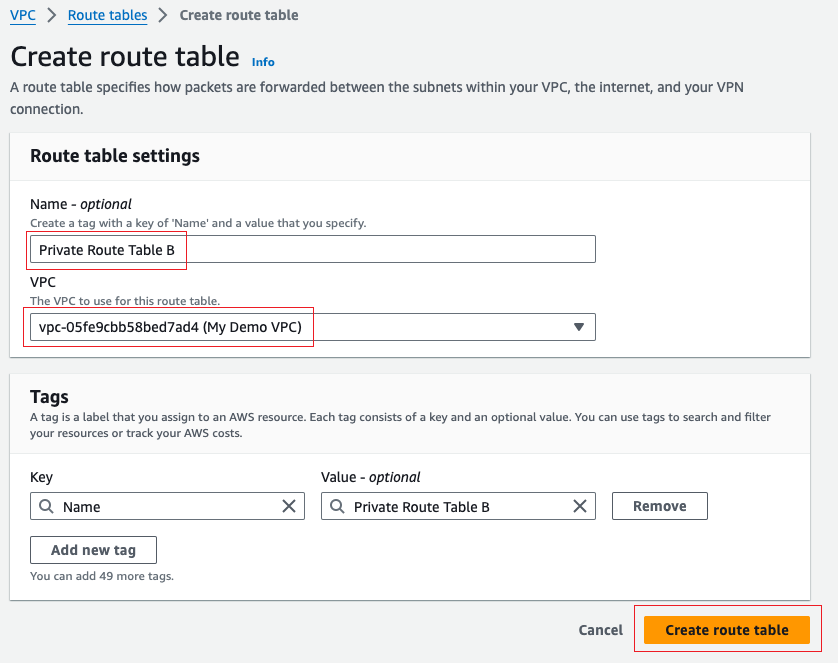

# Create-an-AWS-vpc-from-scratch

## Lab Overview
In this lab I will create a VPC from scratch in the AWS console using services/components like subnets, EC2 Instances, internet gateways, NAT gateways, etc. The VPC architecture that will be built in this lab is shown below.

##### VPC Architecture Design

## Setup
### Step 1: Create the VPC
1. Open the VPC console
2. Click on "Your VPCs" on the left-hand panel
3. Click "Create VPC" button in the top right hand corner
4. Name the VPC "My Demo VPC"
5. Set the IPv4 CIDR block to 10.0.0.0/16 (that's 65,536 IP Addresses we are assigning to our VPC)
6. Leave everything the same and click "VPC" at the bottom right hand corner. 

>TIP: Filter your VPC console with the "My Demo VPC" we just created. This hides components already created for your default VPC. Shown in screenshot below.

### Step 2 - Create the Subnets
##### I will be creating 4 subnets - 2 Public Subnets in separate Availability Zone (AZ) and 2 Private Subnets in the same separate AZs. So we using 2 Availability zones.
1. Open the VPC console
2. Click on "Subnets" on the left-hand panel
3. Click "Create subnet" button in the top right hand corner
4. Click the drop down and select the VPC named "My Demo VPC" that we created in Step 1
5. Name Subnet 1 "Public Subnet A"
6. Choose an AZ "a" for whatever region you are within. For example: "us-east-1a"
7. Set the IPv4 CIDR block to 10.0.0.0/24 [10.0.0.0 - 10.0.0.255] (that's 256 IP addresses)
8. Then click the button "Add new subnet" at the bottom left hand corner. We will complete similar steps shown in 5-7 for the other 3 subnets we will create.
9. Name Subnet 2 "Public Subnet B", Choose AZ "b", Set the IPv4 CIDR block to 10.0.1.0/24 [10.0.1.0 - 10.0.1.255], click "Add new subnet" at the bottom left hand corner
10. Name Subnet 3 "Private Subnet A", Choose AZ "a" (same AZ as Subnet 1), Set the IPv4 CIDR block to 10.0.16.0/20 [10.0.16.0 - 10.0.31.255] (that's 4096 IP addresses), click "Add new subnet" at the bottom left hand corner
11. Name Subnet 4 "Private Subnet B", Choose AZ "b" (same AZ as Subnet 2), Set the IPv4 CIDR block to 10.0.32.0/20 [10.0.32.0 - 10.0.47.255]
12. Click the "Create subnet" button in the bottom right hand corner. 

### Step 3 - Create Internet Gateway and Route Tables
##### Create Internet Gateway
1. Open the VPC Console
2. Click on "Internet gateways" on the left-hand panel
3. Click "Create internet gateway" button in the top right hand corner
4. Name the internet gateway "My Demo Internet Gateway"
5. Click "Create internet gateway" in the bottom right hand corner.

##### Attach the Internet Gateway to "My Demo VPC"

1. Go back to the internet gateway dashboard
2. Select the newly created internet gateway called "Demo Internet Gateway"
3. Click the "Actions" dropdown button at the top right hand corner and click "Attach to VPC"

4. Select the "My Demo VPC" in the drop down and click "Attach internet gateway" button at the bottom right hand corner.

##### Create the Route Tables
_A default route table has already been created for my created VPC. However, I will not use the default route table associated with my VPC. __I will create 3 route tables for my own (Public Route Table, Private Route Table A, Private Route Table B)___

1. Open the VPC Console
2. Click on "Route tables" on the left-hand panel
3. Click "Create route table" button in the top right hand corner
4. Name the 1st route table "Public Route Table", select "My Demo VPC", click "Create route table" button at the bottom right hand corner.

__Public Route Table__

5. Name the 2nd route table "Private Route Table A", select "My Demo VPC", click "Create route table" button at the bottom right hand corner.

__Private Route Table A__

6. Name the 3rd route table "Private Route Table B", select "My Demo VPC", click "Create route table" button at the bottom right hand corner. 

__Private Route Table B__

__Assign Subnets to Route Tables__

_Assign Public Subnets to "Public Route Table"_

1. Go back to the route tables dashboard
2. Select "Public Route Table"
3. Click the "Actions" dropdown button at the top right hand corner and click "Edit subnet associations"

4. Select "Public Subnet A" and "Public Subnet B" then click "Save associations" button in the bottom right hand corner

_Assign Private Route Table A to "Private Subnet A"_

1. Go back to the route tables dashboard
2. Select "Private Route Table A"
3. Click the "Actions" dropdown button at the top right hand corner and click "Edit subnet associations"
4. Select "Private Subnet A" and click "Save associations" button in teh bottom right hand corner

_Assign Private Subnet to "Private Subnet B"_

1. Go back to the route tables dashboard
2. Select "Private Route Table B"
3.Click the "Actions" dropdown button at the top right hand corner and click "Edit subnet associations"
4. Select "Private Subnet B" and click "Save associations" button in teh bottom right hand corner.

__Update Public Route Table to make "Public Subnet A" and "Public Subnet B" Public__

1. Go back to the route tables dashboard
2. Select "Public Route Table"
3. Click the "Actions" dropdown button at the top right hand corner and click "Edit routes"
4. Click "Add route", for Destination route select "0.0.0.0/0", for Target select "Internet Gateway" and select "Demo Internet Gateway", click "Save changes" button at the bottom right hand corner. 

#### Step 4 - Create NAT Gateway (NATGW)
__For high availability we will create 2 NATGW. One in each AZ (One in Public Subnet A and One in Public Subnet B)__

1. Open the VPC Console
2. Click on "NAT gateways" on the left-hand panel
3. Click "Create NAT gateway" button in the top right hand corner
4. Name the 1st NATGW "NATGW A", Select "Public Subnet A" that we created in a previous step, click "Allocate Elastic IP" button, and click "Create NAT gateway" button in the bottom right hand corner

5. Go back to the NATGW dashboard and click "Create NAT gateway" button in the top right hand corner
6. Name the 2nd NATGW "NATGW B", Select "Public Subnet B" that we created in a previous step, click "Allocate Elastic IP" button, and click "Create NAT gateway" button in the bottom right hand corner.

__Connect Route Tables to NATGW__

1. Open the VPC Console
2. Click on "Route tables" on the left-hand panel
3. Select "Private Route Table A"
4. Click the "Actions" dropdown button at the top right hand corner and click "Edit routes"
5. Click "Add route", for Destination route select "0.0.0.0/0", for Target select "NAT Gateway" and select "NATGW A", click "Save changes" button at the bottom right hand corner.

6. Go back to the Route tables dashboard
7. Select "Private Route Table B"
8. Click "Actions" dropdown button at the top right hand corner and click "Edit routes"
9. Click "Add route", for Destination route select "0.0.0.0/0", for Target select "NAT Gateway" and select "NATGW B", click "Save changes" button at the bottom right hand corner. 

>_NOTE: The default NACL allows all inbound and all outbound. We will not change the default NACL settings in this lab. Found in VPC console._

__NACL Inbound Rules__

__NACL Outbound Rules__

#### Step 5 - Create Bastion Host
_Note: For high availability, it would be best to have one bastion host in each AZ. However, for simplicity, I will create one Bastion Host - located in Public Subnet A (as shown in the "VPC Architecture Design" at the beginning of this ReadMe)_

1. Open the EC2 console
2. Click "Instances" on the left-hand panel
3. Click "Launch instances" button in the top right hand corner
4. Name the instance "Bastion Host"
5. Keep AMI as Linux, Keep architecutre 64-bit(x86), Keep instance type t2 micro (to stay within the free tier)
6. Key Pair: Select "Proceed without a key pair (Not recommended)" _In this lab I will be using the EC2 Connect to SSH into the instance and to test the architecture. Thus, I will not need a key pair here. However, if you want to further secure your instance and if use your own SSH client then a key pair will be needed._
7. Edit Network Settings: Change the Default VPC to "My Demo VPC", Change subnet to "Public Subnet A", Enable auto-assign public IP.
8. Edit Security Group (SG): Select "Create security group", name the SG "BastionHostSG", Description:"Security group for Bastion Host" (Optional), Allow SSH from anywhere, 0.0.0.0/0
9. Click "Launch instance" button at the bottom right hand corner. 

#### Step 6 - Create Private EC2 Instances
__Create Private Insance in Private Subnet A__

1. Go back to the EC2 console
2. Click "Launch instances" button in the top right hand corner
3. Name the instance "Private Instance A"
4. Keep AMI as Linux, Keep architecutre 64-bit(x86), Keep instance type t2 micro (to stay within the free tier)
5. Key Pair: Click "Create new key pair", Name the keypair "VPCKeyPair", keep everything else default and click "Create key pair" button at the bottom right hand corner - the private key pair file will be downloaded to your computer. _Make sure to store this file in a known place on your computuer. I will have to use the contents in this file in a later step._

6. Edit Network Settings: Change the Default VPC to "My Demo VPC", Change subnet to "Private Subnet A", DO NOT enable auto-assign public IP (this is our private instance and it should not have a public IP address)
7. Edit Security Group (SG): Select "Create security group", name the SG "PrivateInstanceSG", Description: "Security group for private instance A and private instance B" (Optional), Allow SSH from Custom: Select the SG of the Bastion Host
8. Click "Launch instance" button at the bottom right hand corner.

__Create Private Instance in Private Subnet B__

1. Go back to the EC2 console
2. Click "Launch instances" button in the top right hand corner
3. Name the instance "Private Instance B"
4. Keep AMI as Linux, Keep architecutre 64-bit(x86), Keep instance type t2 micro (to stay within the free tier)
5. Key Pair: In the dropdown select the keypair "VPCKeyPair"
6. Edit Network Settings: Change the Default VPC to "My Demo VPC", Change subnet to "Private Subnet B", DO NOT enable auto-assign public IP (this is our private instance and it should not have a public IP address)
7. Edit Security Group (SG): Click "Select existing security group", Select the "PrivateInstanceSG" SG,
Click "Launch instance" button at the bottom right hand corner.

### Test System
I am going to test our infrastructure to make sure I can properly SSH into the Bastion host and the private EC2 instances. I will also make sure our Bastion host and our private instances have access to the internet via the route tables, the internet gateway, and the NAT gateway (private instances only).

#### Step 7 - SSH into Bastion Host and into Private Instances to Test Connectivity
__1. SSH into our Bastion Host using EC2 Connect__

_EC2 connect is an AWS feature that allows us to easily and securely SSH into our instances without the need of an external SSH client like Putty_

1. Open the EC2 console
2. Select the "Bastion Host"
3. Click the "Connect" button at the top right of the page

4. Click "Connect" button at the bottom right of the screen

5. If you get a screen like the one below then you have successfully SSH into your Bastion host.

__2. Test if the Bastion Host has access to the internet.__

1. Type "ping www.google.com" and hit Enter into the terminal window. You should receive feedback as shown in the screen shot below.
2. Make sure to hold Ctrl and press "C" to stop the ping.
3. If your outcome is similar to what's shown below then your Bastion host has access to the internet.

__3. SSH into Private Instance A from our Bastion Host.__

1. Type "nano VPCKeyPair.pem" and hit Enter (nano command allows us to create and store a text file within the terminal. We need to upload our VPCKeyPair so we can reference it when we SSH into the Private Instance)
2. Go to the VPCKeyPair.pem file saved on your computer. Open it. Copy ALL the content. Paste it into the terminal (hint hold ctrl and shift and press "v")

3. Hold ctrl and press "X" to exit. Save the content by press Y for yes. Then press "Enter".

>_Our uploaded VPCKeyPair.pem text file is formated for others to access it (current chmod access code is 644 - "chmod 644"). It is required that your private key files are NOT accessible by others. Therefore, we must change the access permissions for only us to have access ("chmod 400"). For that we will use the "chmod" command._

4. Type "chmod 400 VPCKeyPair.pem" and press Enter. This remove access for others and only allows read access to us.
5. In a seperate tab, go to the EC2 console
6. Select "Private instance A" and copy the private IP address as shown in the screenshot below. We will need to reference this IP address to SSH into it. Go back to the EC2 Connect Window terminal.

>_Now we are ready to SSH into our Private Instance A via our Bastion host by using our keypair_

7. Type "ssh ec2-user@INSERT YOUR PRIVATE IP ADDRESS YOU JUST COPIED -i VPCKeyPair.pem". Hit Enter. "ssh ec2-user@10.0.24.252 -i VPCKeyPair.pem"
8. A prompt will come up asking if your are sure you want to connect. Type "yes" and you should have successfully SSH into your Private Instance A via your bastion host.

__4. Test if Private Instance A has access to the internet.__

1. Type "ping www.google.com" and hit Enter into the terminal window. You should receive feedback as shown in the screen shot below.
2. Make sure to hold Ctrl and press "C" to stop the ping.
3. If your outcome is similar to what's shown below then your Bastion host has access to the internet.

Repeat the Steps 3-4 for Private Instance B if you want to SSH into it and if you want to test if it has access to the internet. 
___NOTE: Remember to use the correct private IP address when executing the "ssh ec2-user@10.0.24.252 -i VPCKeyPair.pem" command.___

### Clean Up

#### Step 8 - Delete all of the Instances - In the EC2 Console

#### Step 9 - Delete all NAT gateway (Make sure to delete BOTH NATGW A and NATGW B) - In the VPC Console

>*Must wait until the EC2 instances and the NAT gateway to COMPLETELY Delete/Terminate before Step 10 (shouldn't take longer than 5-10mins)*

#### Step 10 - Release Unused IP Addresses
1. Go back to the EC2 console
2. Navigate to the Elastic IPs Section
3. In the Elastic IPs section, you will see a list of all your Elastic IPs. Check the Associated Instance ID column to see if the IP is attached to any instance. If this column shows as "Not associated" or "N/A", the IP address is unused.
4. Select the Elastic IP address that is not associated with any instance. Click the Actions dropdown menu, and then click Release Elastic IP addresses. Confirm the release when prompted.

#### Step 10 - Delete Demo VPC - In the VPC Console | FINAL STEP
Deleting the VPC will delete all of the associated subnets, internet gatways, route tables, security groups, etc.

# Trobleshooting
I reference on the YouTube video [How to Create a VPC in AWS from Scratch](https://www.youtube.com/watch?v=r-26_oUKDA4) for proper understanding on how to create a VPC.