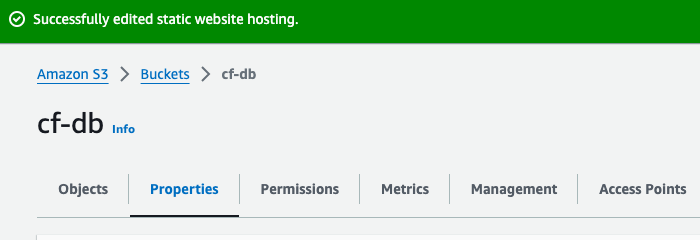

# S3 Bucket Policy for CLoudFront Access

## Purpose:
#### To configure an S3 bucket policy that allows access only from a specific CloudFront distribution. This ensures that the S3 content is securely saved through CloudFront, and direct access to the S3 bucket is restricted.

### 1. Create an S3 Bucket:
- Login to the AWS Manangement Console.
- Navigate to the S3 service.
- Click the "Create bucket" button.
- Follow the prompt to configure the S3 bucket.

### 2. Upload Static Website Content
- Create an HTML static content files for your website.
- Upload the file to your S3 bucket.

### 3. Configure S3 for Static Website Hosting
- In the S3 bucket properties, navigate to the "Static Website Hosting" section.
- Choose "Use this bucket to host a website" and configure the index document.

### 4. Create a CloudFront Distribution
- Navigate to the CloudFront Service in AWS Management Console
- Click the "Create Distribution" button
- Choose "Web" distribution type
- Configure the settings, specifying S3 bucket as the origin.
- Origin access should be "Origin access control setting" {Bucket can restrict access to only CloudFront}

- Create an "Origin Access Control"
- Write 'index.html' in the "Default root object

### 5. Configure S3 bucket policy
- Copy the S3 policy created by CloudFront
- Go to S3 bucket permissions to update policy

### 6. Test Access Restrictions
- Attempt to access an object directly from the S3 bucket using its S3 URL. This should be restricted.
- Access the object through the CloudFront distribution URL (distribution domain name) and verify that it works

# TROUBLESHOOTING
#### I found it difficult creating and navigating through the CloudFront distribution, I had to go on YouTube and wathced a video [Tiny Technical Toturials](https://www.youtube.com/watch?v=GUfAQUjA3a0&t=235s), and it explained all I needed to know. 