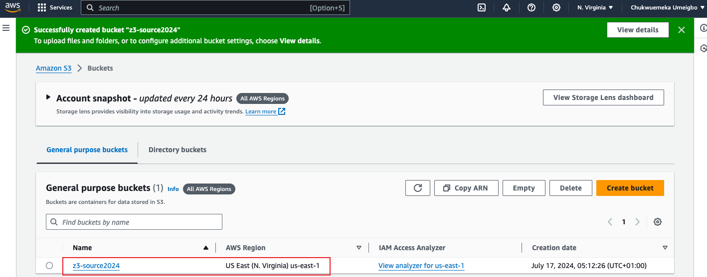
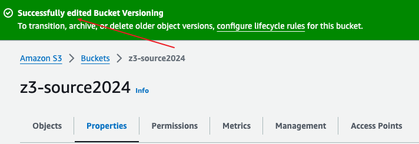
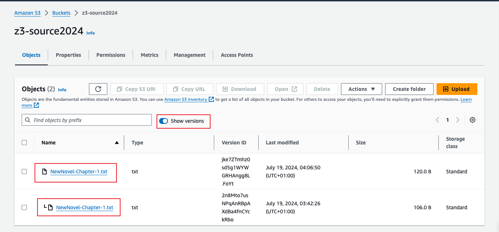
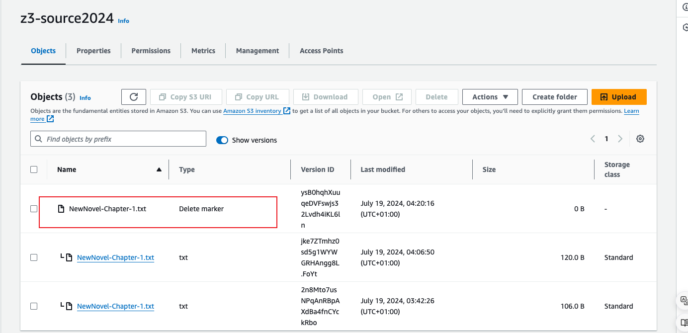
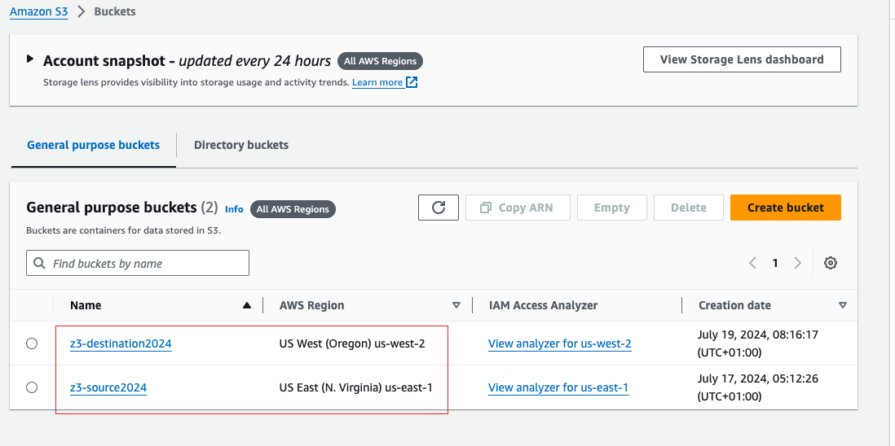
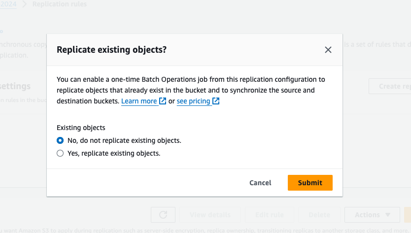
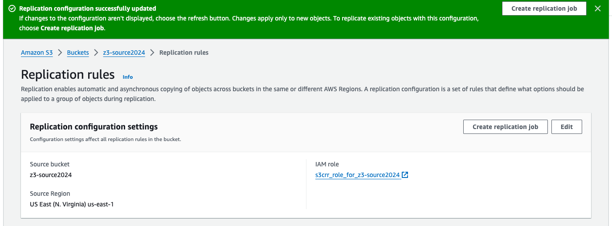
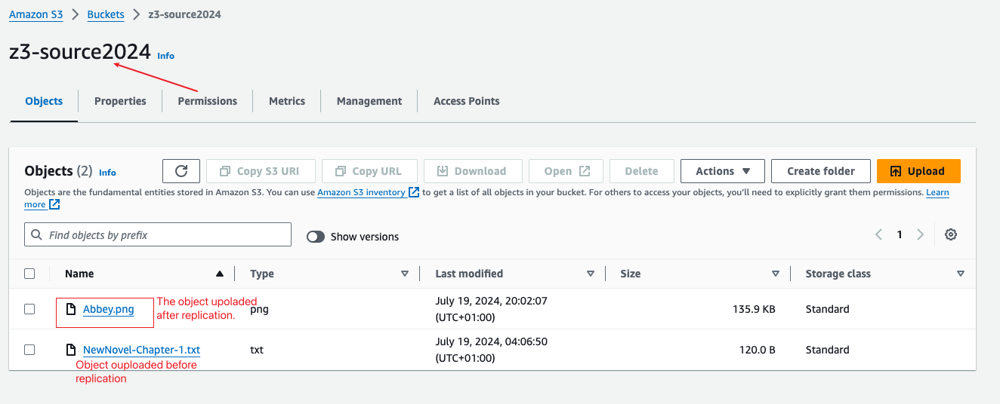
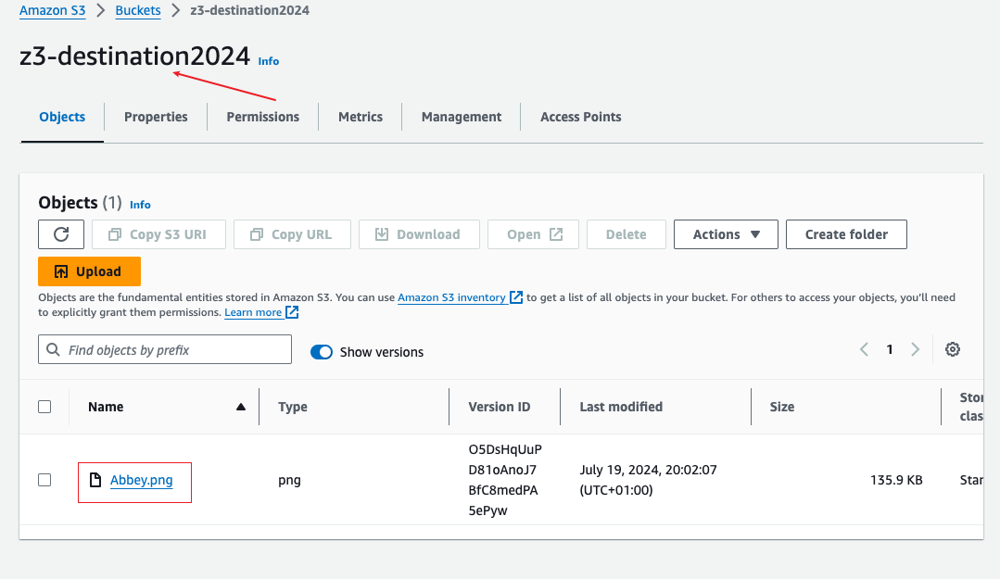

# S3 Versioning and Replication

## Purpose:
#### In this project I will explore Amazon S3 versioning and replication features. I will create S3 bucket, enable versioning, configure cross-region replication, and test the versioning and replication functionalities.

### 1. Create an S3 Bucket:
- Login to the AWS Manangement Console.
- Navigate to the S3 service.
- Click the "Create bucket" button.
- Follow the prompt to configure the S3 bucket.

### 2. Enable Versioning:
- In the S3 bucket properties, navigate to "Versioning" section.
- Enable versioning for the S3 bucker.

### 3. Test Versioning:
- Upload an object in the S3 bucket.
- Modify the object, upload it and observe versioning behaviour.

When you delete the file, a "delete marker" will appear when you click of "show version". In order to restore the deleted file, you will have to delete the "delete marker"

- Check the version history of the object. 
### 4. Configure Cross-Region Replication:
- Ceate two buckets, "the source bucket" and "the destination bucket" with different regions.
> You can replicate objects across buckets in different AWS Regions (Cross-Region Replication) or you can replicate objects across buckets in the same AWS Region (Same-Region Replication)

- Upload a file in the **source bucket** before cross-replication configuration.

>Youn can choose to replicate existing objects from the source buckets to the destination buckets or decide not to.

- On the source bucket configure cross-replication rule. Navigate to "**Management**" tab, click on "**Replication rule**". Follow the prompts to successfully create the replication rule.

>While following the prompts, you can either choose an IAM role or create an IAM role. After creating you can access the IAM role link and go to the plolicy to see and edit (if you want) the IAM role.
### 5. Test Replication:
- Upload an object to the S3 source bucket
- Verify that the object is replicated in the destination region.
> Note: When you delete the replicated object form the source bucket, AWS will retain the object in the destination region. You will have to manually delete the object from the destination region.

# TROUBLESHOOT
After creating my first bucket and uploading an object on it. While trying to create the second bucket in a different region, I encountered an error, I tried so many times but it didn't work. I tried checking out what the error might be and how to reslove it, I was adviced to wait for some time and create it again. I did it and it worked.
