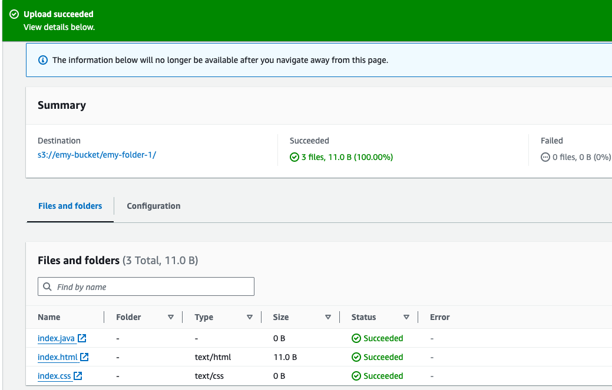
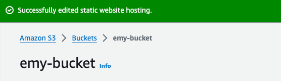
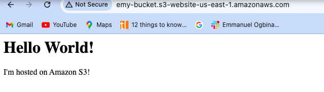

# Static Website Hosting

## Purpose:
#### In this project, I will set up a static website using Amazon S3 static website hosting. The project is a guide through creating an S3 bucket, uploading static website content,configuring the bucket for static website hosting, and testing the hosted website. 

#### 1. Create an S3 bucket
- Log in to the AWS Management Console.
- Navigate to the S3 Service.
- Click the "Create bucket" button.
- Follow the prompt to configure the S3 bucket.

#### 2. Upload Static Website Content
- Gather HTML, CSS and other static content files for your website.
- Upload these files to your S3 bucket.

#### 3. Configure S3 for Static Website Hosting
- In the S3 bucket properties, navigate to the "Static Website Hosting" section.
- Choose 'Use this bucket to host a website' and configure the index document.

#### 4. Access the Static Website
- Obtain the provided endpoint URl from the S3 bucket properties.
- Off "Block all public access" and apply bucket policy.
- Access the static website using the provided endpoint and verify that it displays correctly.

