## Lab Overview
In this lab, I will be connecting two virtual offices in the cloud so they can talk to each other directly. Just imagine two neighboring offices sharing files and chatting without going through a middleman.

### Why do we need VPC Peering?
We need VPC peering when we want different parts of our cloud network (VPCs) to work together smoothly. Maybe you have one VPC for your development team and another for your marketing team, and you want them to share data securely. That’s where VPC peering comes in handy—it lets these VPCs communicate directly, making things easier for everyone.

Additionally, there are some key points that you should be aware of:

* Two VPCs cannot connect to each other. You need to set up VPC peering or use a VPN or Direct Connect to establish connectivity between VPCs.
* Subnets within the same VPC can communicate with each other by default. AWS sets up route tables to allow communication within the same VPC.
* EC2 instances in the same subnet can communicate with each other by default, assuming they have proper security group rules allowing the desired traffic.
* EC2 instances in different subnets within the same VPC can also communicate with each other by default, as long as their associated route tables are configured to allow traffic between subnets.

**Now come to the practical part,**

### Step 1: Let's begin by creating two VPCs in the same region. Alternatively, you may choose a different region if needed.
1. Open the VPC console
2. Click on "Your VPCs" on the left-hand panel
3. Click "Create VPC" button in the top right hand corner
4. Name the VPC "Requester VPC"
5. Set the IPv4 CIDR block to 192.168.0.0/16
6. Leave everything the same and click "Create VPC" at the bottom right hand corner. We will complete the same steps to create the second VPC.
7. Name the VPC "Accepter VPC"
8. Set the IPv4 CIDR block to 172.16.0.0/16
9. Leave everything the same and click "Create VPC" at the bottom right hand corner.

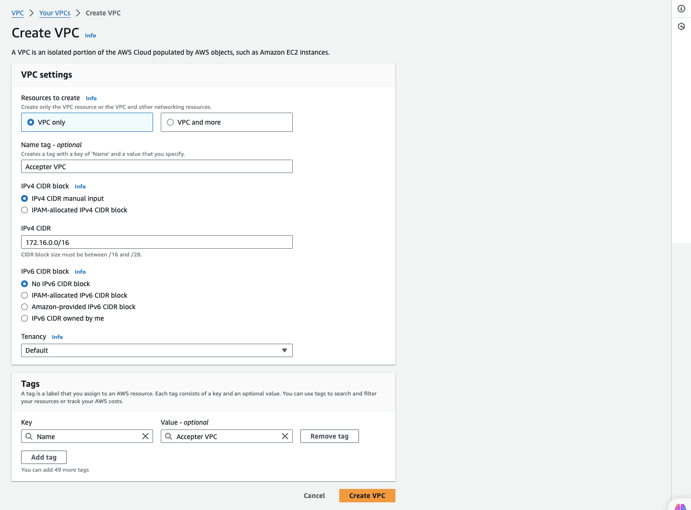

### Step 2: Peering Connection
1. Navigate to Peering Connection on the left-hand panel.
2. Upon clicking, you will directed to VPC peering page. Click on the "Create peering Connection" button in the top right hand corner.

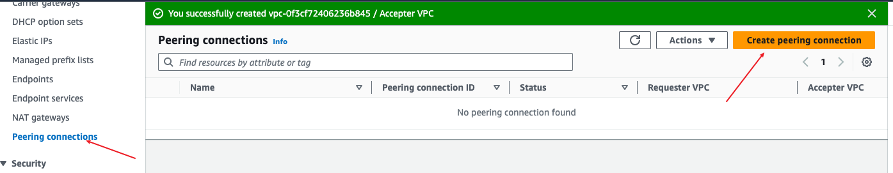

3. Name it "My 1st VPC Peering"
4. Select "Requester VPC"
5. Choose the account "My account" since the VPCs are in our AWS account.
6. Ensure to use the region. This Region "us-east-1", as the VPCs were created in the same region.
7. Select the "Accepter VPC"
8. Proceed by clicking "Create peering conection" button at the bottom right hand corner. 

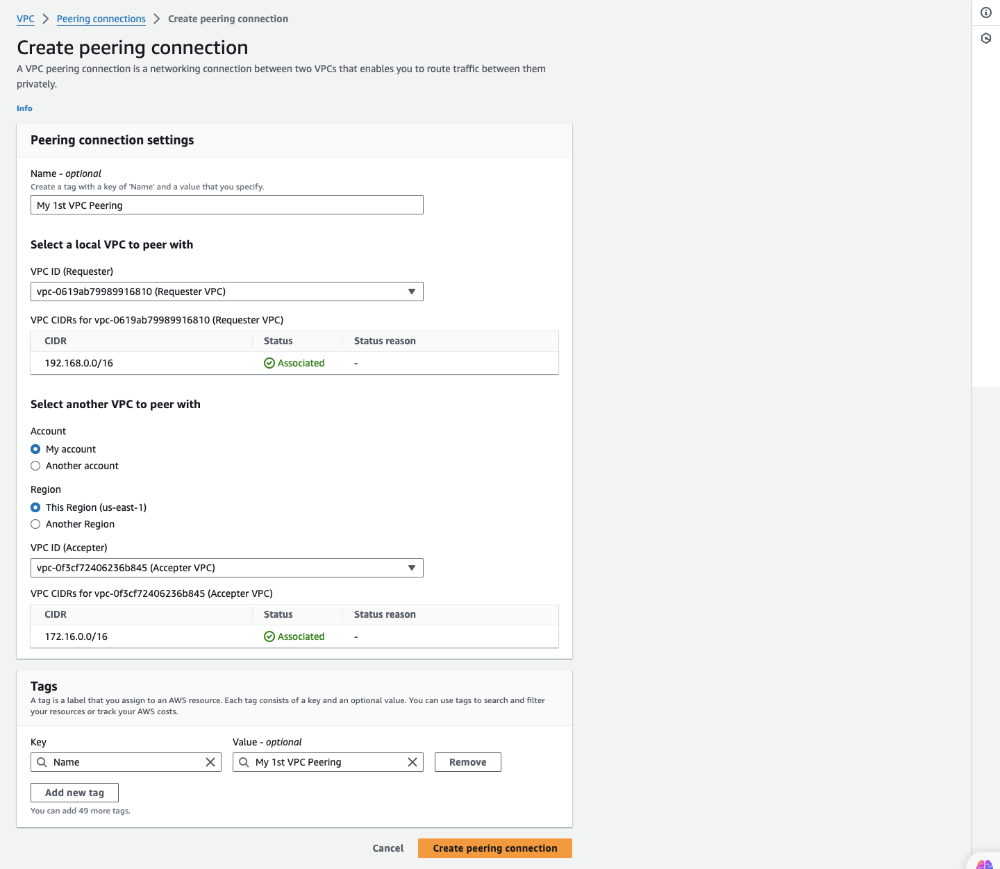

Then you will see this,

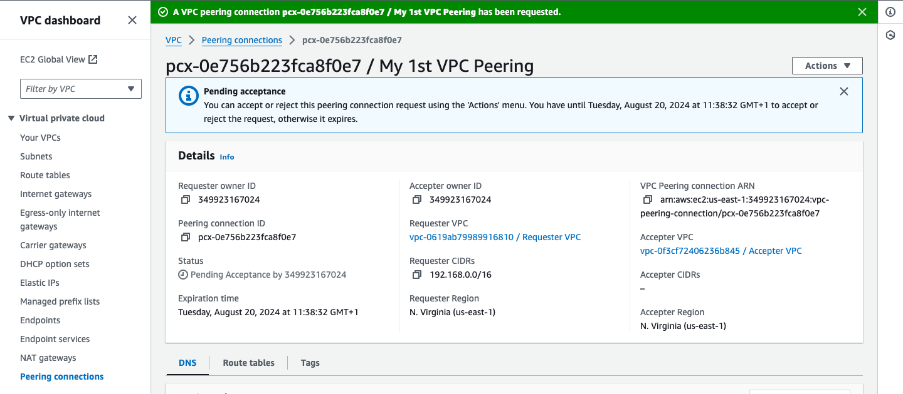

10. In the peering connection page, locate the "Action" on the top right hand side, click on it and then select "Accept request"

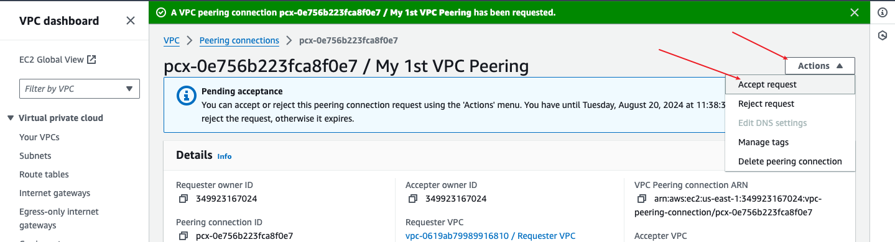

11. Click on "Accept request" button on the bottom right corner.

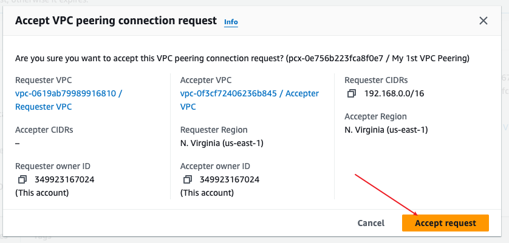

### Step 3: Add a Route to the Peered VPC
1. Click on "Your VPCs" on the left-hand panel
2. Scroll to the right, and click on the Main route table ID of the __Accepter VPC__.

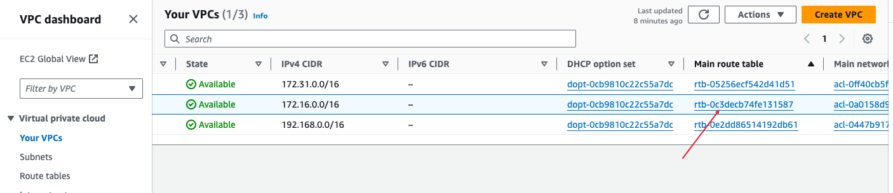

3. Choose the route table
4. Navigate to the "Route" section and click on "Edit route" on the left hand side.

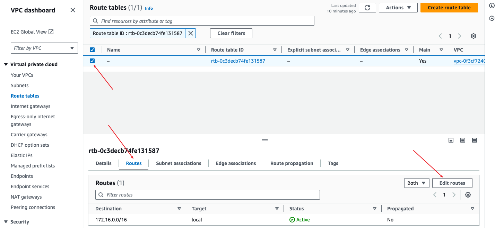

5. CLick on "Add route"
6. Go to Vpc page, and select the Requester VPC.
7. In the details tab, you will find the IPv4 CIDR (In this case - 192.168.0.0/16). Copy the CIDR and paste in the "destination" field when adding the route. 

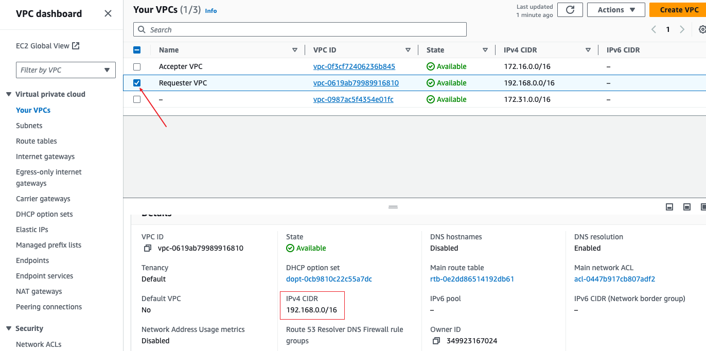

8. In the "target", choose VPC peering and then choose the peering connection you have created. Click on "save changes".

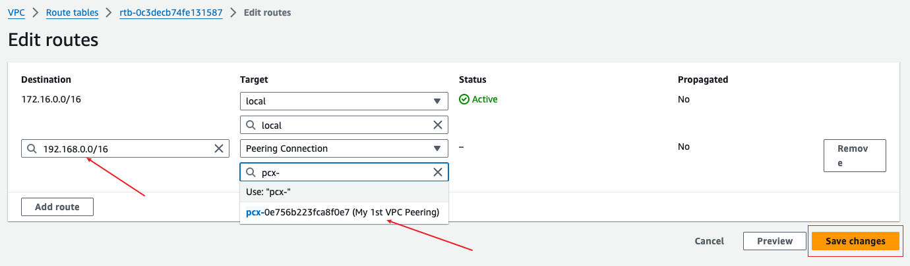

> Now we are going to do the same thing we did to the Accepter VPC to the Requester VPC by adding the IPv4 CIDR of the Accepter VPC as the destination in the Requester Main Route Table.

9. Go to Vpc page, and select the Accepter VPC.
10. In the details tab, you will find the IPv4 CIDR (In this case - 172.16.0.0/16). Copy the CIDR and paste in the "destination" field when adding the route. 

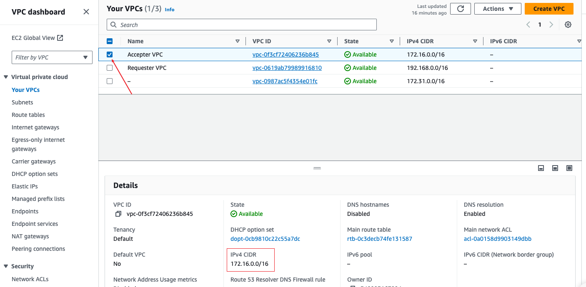

11. Still on "Your VPCs", scroll to the right, and click on the Main route table ID of the __Requester VPC__.
12. Choose the route table, and navigate to the "Route" section and click on "Edit route" on the left hand side.

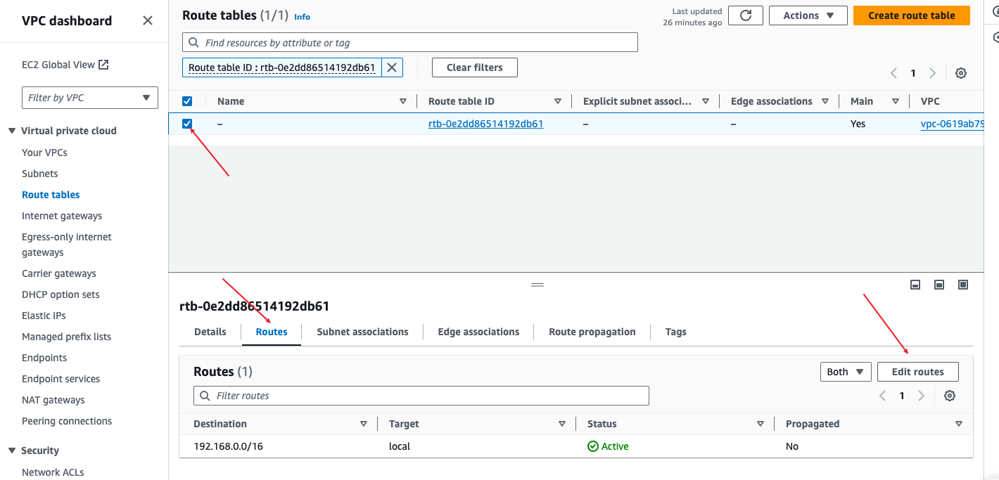

13. Click on the "Add route", and paste the CIDR of the Accepter VPC that was copied in the "Destination" field.
14. In the "target", choose VPC peering and then choose the peering connection you have created. Click on "save changes".

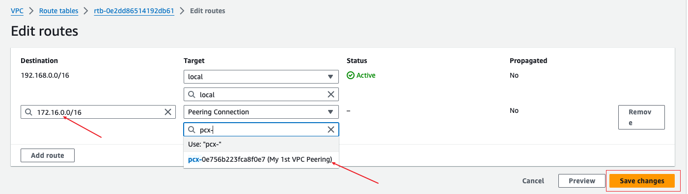

The connection has been successfully established. Now, resources in the Accepter VPC can now connect to the resources in the Requester VPC, and vice versa, because both VPCs now have the IPv4 CIDR of each in their various route destinations.

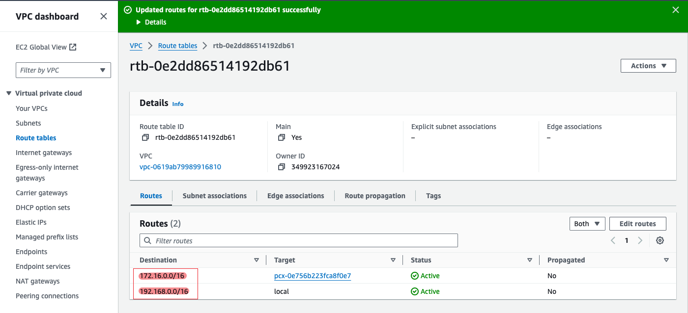

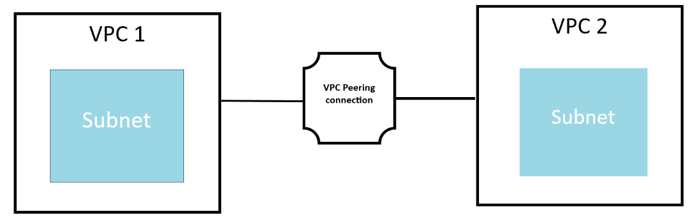